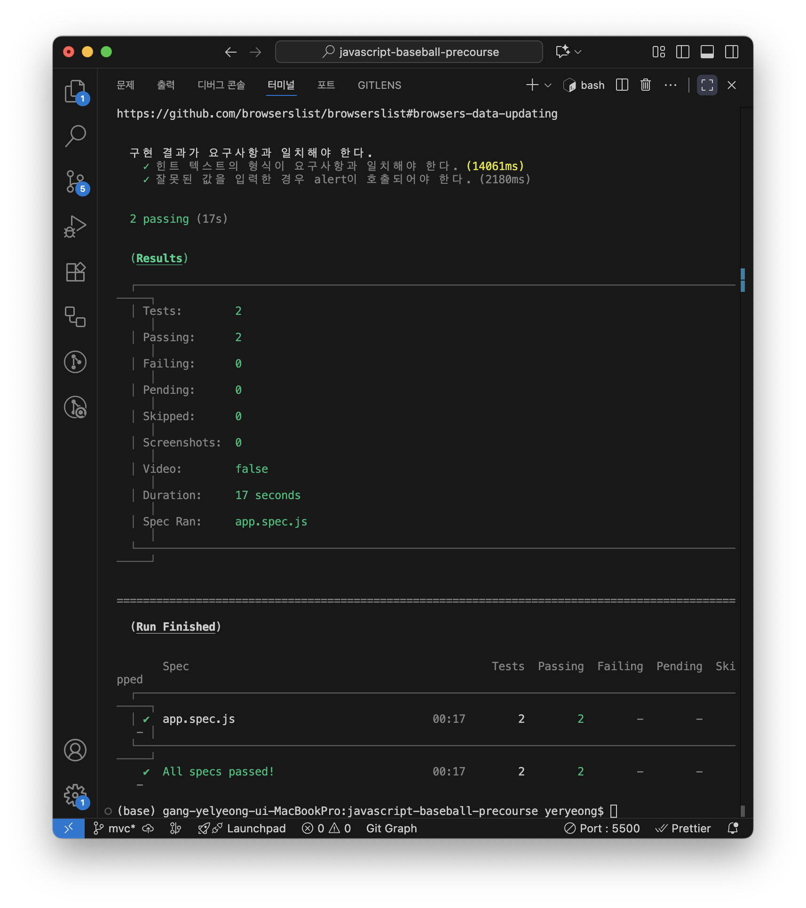

안녕하세요, 정수영 리뷰어님! 
그리디 프론트엔드 3기로 함께하게 된 강예령입니다. 
2주차 미션은 기존의 숫자 야구 게임 코드에서 MVC 패턴을 적용하면 된다고 해서 기존 하나의 index.js 파일을 기능에 맞춰 분리해보았는데, 구조나 코드에서 부족한 부분이 있다면 많은 피드백 부탁드립니다! 
앞으로 잘 부탁드립니다! 감사합니다!

## MVC 패턴 적용

- Model: 게임 규칙(유효성 검증/결과 판정/정답 생성) 담당
- View: DOM 업데이트/알림 담당 -> UI 부분
- Controller: 이벤트 핸들러 역할, Model과 View 사이에서 값 전달

> **Model**
>
> - **메인 기능**에 관한 로직(도메인 관련) 처리
> - **결과**를 Controller에 전달
>
> 숫자 야구 게임의 규칙 및 판단 기능을 담당하는 파일이라고 생각했습니다. 
> 결과를 Controller에 전달해야하기 때문에 함수를 정의할 때 export를 사용했습니다. 
> BaseballGame, isValidInput, scoreStrikeBall, judgeResult, makeComputerInput 함수를 포함합니다.

> **View**
>
> - 보여지는 역할
> - Model이 처리한 **결과**로 사용자에게 **출력할 화면** 구성
> - **Controller에게** Model의 데이터를 전달받음
>
> 화면을 다루는 코드만 모았고, 공통적으로 보여야하는 부분을 메서드로 묶었습니다. 
> 어떤 값(데이터)을 보여주는지는 Controller가 Model에서 받아오고, 어디에 표시할 것인지를 View에서 처리하도록 했습니다.

> **Controller**
>
> - **사용자 입력**에 반응
> - Model과 View 사이에 위치 -> Model의 **결과 데이터**를 View에 **전달**
>
> 이벤트 핸들러 부분이 Controller의 핵심 기능이라고 생각했습니다. 
> 또한 index 파일은 시작점인데, Controller의 역할이 가장 적합하다고 생각해서 index.js를 Controller 파일로 설정했습니다. 
> Model과 View 파일의 함수들을 import 해왔습니다.

## 테스트 결과

